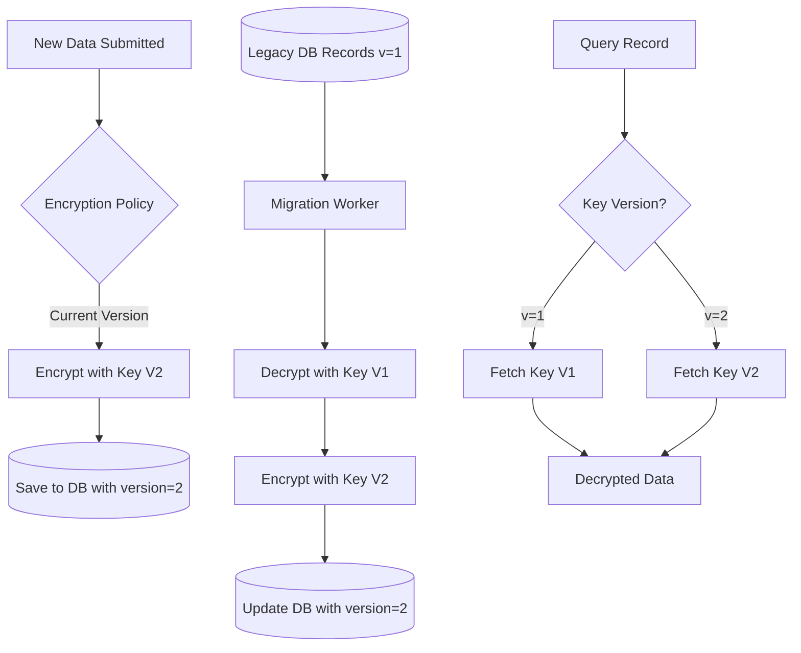

# Part 3: System Design & Incident Response

## Scenario A: Key Rotation Strategy for Millions of Records

### 1. The Core Challenge
Migrating millions of records encrypted with a single Data Encryption Key (DEK) to a new key without downtime is impossible with a "stop-the-world" approach. We must use a **Key Versioning** and **Background Migration** strategy.

### 2. Strategy: Envelope Encryption & Lazy Migration

#### A. Architecture Change: Key Versioning
We evolve our storage schema to include a `key_version` field:
- **Old Schema**: `{ id, encrypted_data }`
- **New Schema**: `{ id, encrypted_data, key_version }`

#### B. The Zero-Downtime Migration Pipeline

1.  **Phase 1: Dual-Key Read, New-Key Write**
    - Generate `Key V2`. Leave `Key V1` in the Key Vault.
    - **Write Logic**: All *new* submissions are encrypted using `Key V2`.
    - **Read Logic**: The application checks the `key_version` of a record. 
        - If `version == 1`, use `Key V1`.
        - If `version == 2`, use `Key V2`.
    - *Result*: System is already running on the new key for new data. Zero downtime.

2.  **Phase 2: Background Batch Migration**
    - Launch a separate worker process (e.g., a Celery task or batch job).
    - It iterates through the database for records where `key_version == 1`.
    - It decrypts with `Key V1`, re-encrypts with `Key V2`, and updates the record.
    - **Optimization**: Use database transactions and rate-limiting to avoid locking tables or exhausting IOPS.

3.  **Phase 3: Cleanup & Revocation**
    - Once the count of `key_version == 1` reaches zero.
    - Archive `Key V1` (moved to long-term cold storage for audit/recovery).
    - Remove `Key V1` from the active application's memory.

### 3. Key Lifecycle Diagram (Mermaid)


---

## Scenario B: Data Leak Incident Response

### 1. Immediate Actions (The First 60 Minutes)
As a Senior Developer, I would trigger the **SANS PICERL** framework:

1.  **Containment (Stop the bleeding)**:
    - **Apply Log Masking Filter**: Immediately push a configuration change to the logging pipeline (e.g., CloudWatch Log Filters) to redact anything matching the National ID pattern.
    - **Deploy Hotfix**: Remove the `print()` or `logger.info(decrypted_id)` statement from the code.
2.  **Notification**: Inform the Security/DPO (Data Protection Officer) and Legal teams according to GDPR/local compliance laws.

### 2. Remediation (Cleanup)
- **Scrubbing Logs**: Use the Cloud Logging API (e.g., `gcloud logging logs delete` or AWS CloudWatch `DeleteLogEvents`) to purge the specific log streams for the last 24 hours.
- **Audit Access**: Check the log-viewer access history to see if any unauthorized users (or external IPs) viewed the sensitive logs during the leak window.
- **Data Rotation (Strictness)**: While the PII itself isn't a "key" that can be rotated, if session tokens or private keys were leaked alongside, they must be revoked immediately.

### 3. Technical Controls (Prevention)

#### A. Automated Data Loss Prevention (DLP)
- Implement a **DLP Gateway** (like Google Cloud DLP or Amazon Macie) that automatically scans outgoing logs and redacts PII based on regex patterns (e.g., `[0-9]{3}-[0-9]{3}-[0-9]{3}`).

#### B. Engineering Best Practices
- **PII Wrapper Class**: Use a dedicated Type/Class for sensitive data in Python that prevents accidental logging.
  ```python
  class SensitiveData:
      def __init__(self, value):
          self._value = value
      def __repr__(self):
          return "********"  # Prevents logging via print() or logger
      def get_raw(self):
          return self._value
  ```
- **Custom Linters**: Add a custom ESLint/Pylint rule or a Git pre-commit hook (like `git-secrets` or `trufflehog`) to scan for patterns that look like logging of sensitive variables.

#### C. Shift-Left Security
- Mandatory **Security Review** for any Code Change that touches the `/services/crypto.py` or `/routers/api.py` files.
- Use **Masked Logs** by default in production; only allow full logging in strictly audited debug environments.
